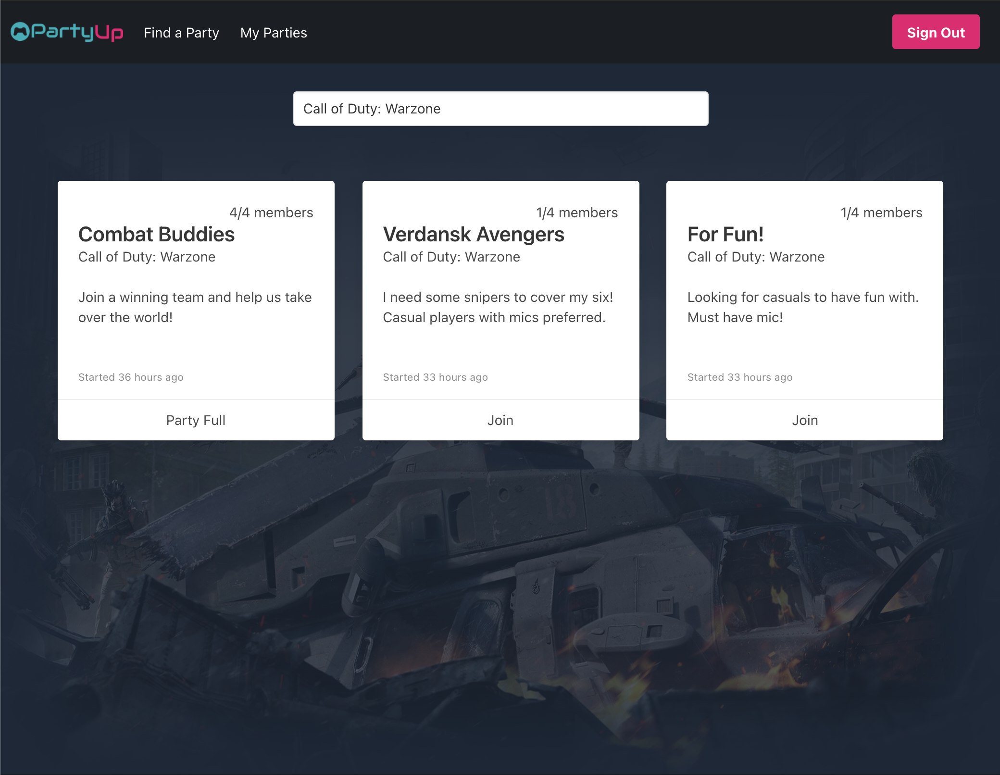
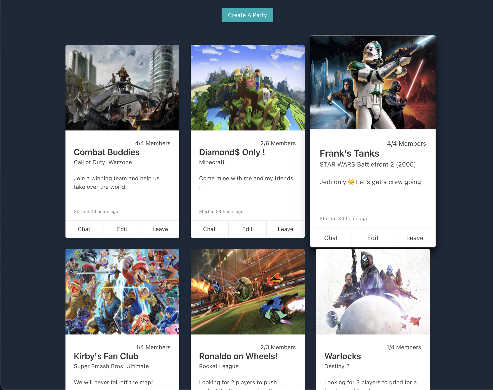

# Party Up

## Motivation
As a gamer, playing with your favorite video games with friends is the key to having fun. But what do you do  when you cannot find any friends to play with? You Party Up! Party Up is an application that allows users to search for and create groups, or as gamers say, parties, based on any game that they enjoy to play.
 
## Live Website
http://party-up.surge.sh/
 
## Build Status
Working Version 1.0
  
## Screenshots

 
## Tech/Framework used
 
  <b>Built With</b>

  JavaScript, React, Redux, Node.js, Express, MongoDB, Socket.io, Bulma, HTML, and CSS.
   
## API Reference

RAWG API

## How to use

## Credits
